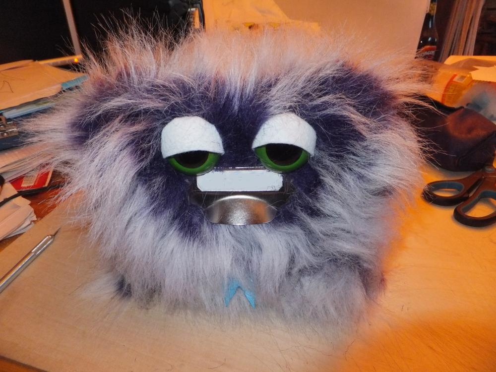
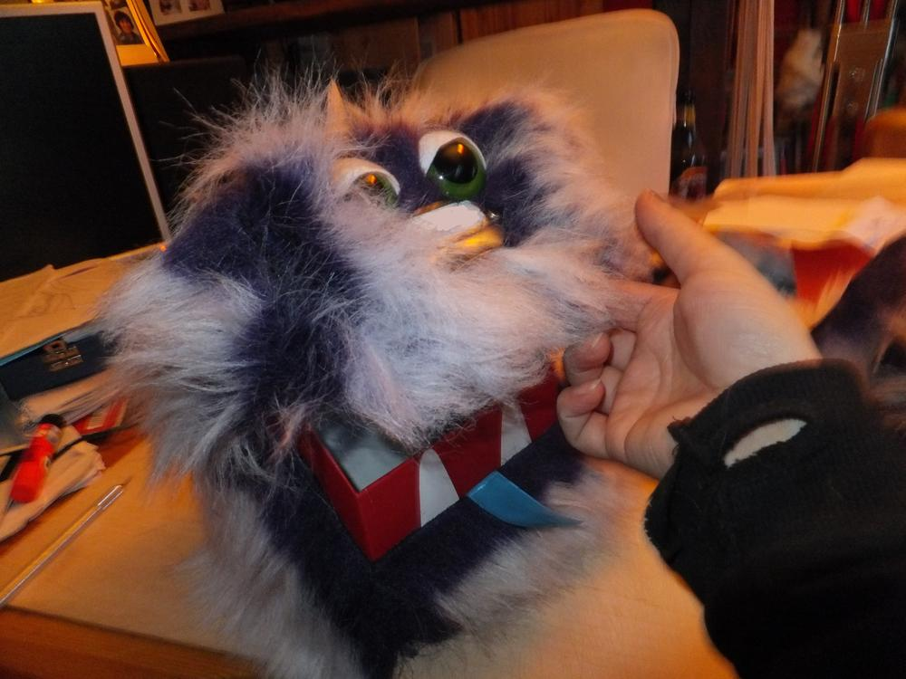
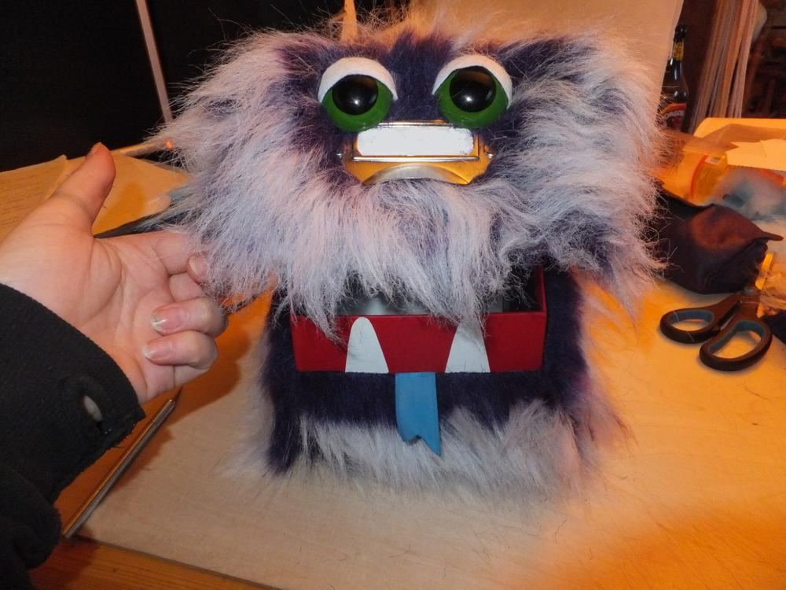
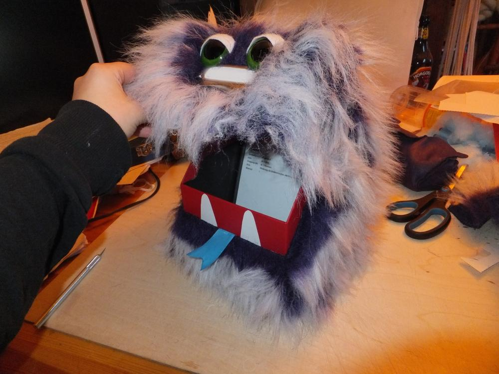

Also irgendwie fand ich den alten Karteikasten zu langweilig. Nach Karneval war der Flauschestoff im Angebot und ich hab mich daran gemacht den Karteikasten mit dem Stoff zu umkleben. Die Augen habe ich von alten Hauspuschen, die leider irgendwann kaputtgelaufen waren. Das Beste von allem ist jedoch das Grußkarten-Sprachmodul, das ich mir bei Pearl gekauft habe. Da kann man eigene Soundaufnahmen abspielen, wenn der Lichtsensor durch öffnen des Deckels aktiviert wird. Nom Nom Nom.  
