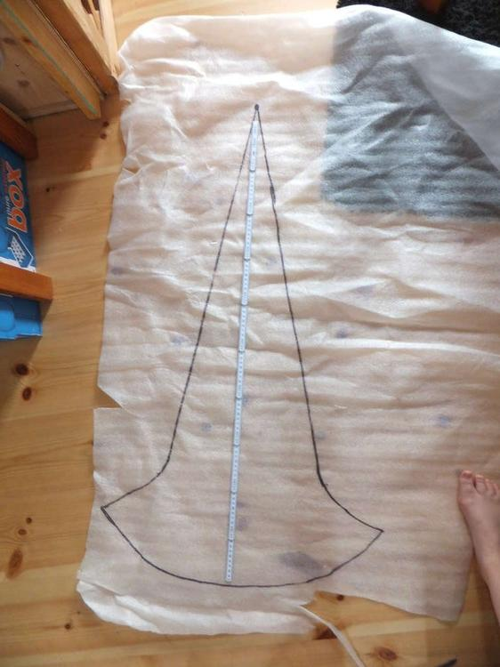
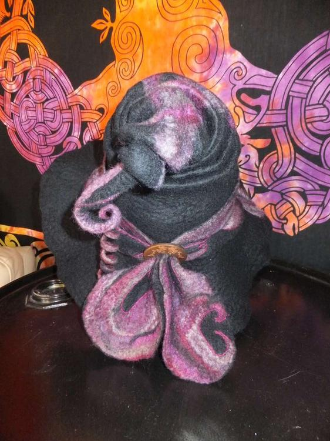
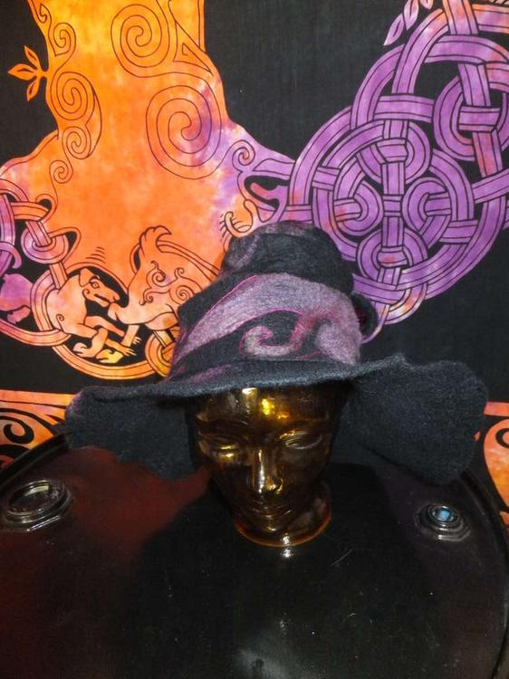

Und meine Freude ist riiiiiesig. Endlich darf auch Ermeline mit einem schönen Merinoflausch-Hut herumlaufen und nicht mehr mit dem improvisierten [Erstlingsunfall](http://flauschiversum.de/2014/07/ermelines-neuer-hexenhut/) aus der Waschmaschine.

Damit die Zieharmonika geformt werden konnte musste ich meine übliche Form auf einen Meter verlängern.  

Das Hutband habe ich noch nachgestickt, damit die Formen noch deutlicher herauskommen und ich lieeeebe diesen lustigen Zwirbel an der Spitze, dafür muss man nur das Band um einen Bleistift wickeln, ein wenig walken und so trocknen lassen.  

